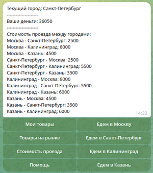
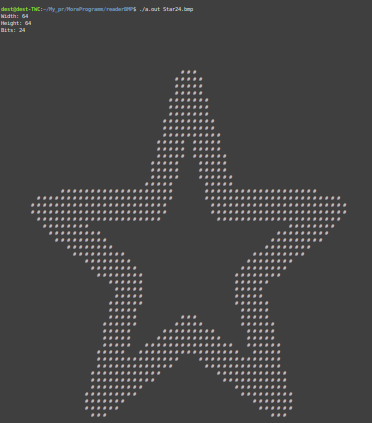
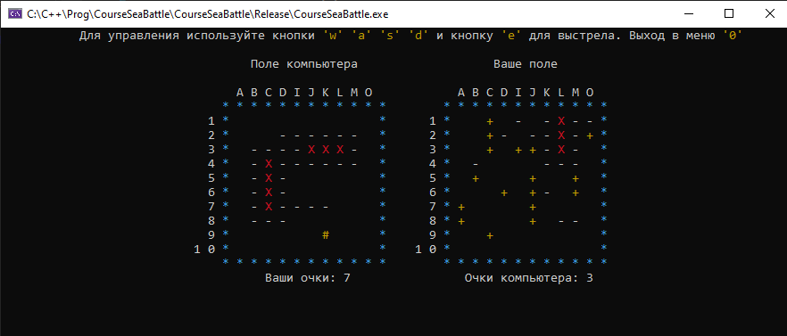

# MoreProgramm

Welcome to my repository! My name is Denis Petrov. I am currently looking for a job, with C++ being my main programming language, though I am open to other languages as well. I hold a diploma in professional retraining from MIPT with a specialization in 'C++ Developer'.

If you are interested in collaboration or have job opportunities, feel free to contact me:

- **Email:** [mebelholm@yandex.ru](mailto:mebelholm@yandex.ru)
- **Telegram:** [https://t.me/Janjan0](https://t.me/Janjan0)

This repository contains implementations of various algorithms and programs.

## Root Directory

The following files are located in the root of the repository:

- **[`CMakeLists.txt`](CMakeLists.txt)** - build file for some programs
- **[`catch.hpp`](catch.hpp)** - file for testing
- **[`codestyle_checker.sh`](codestyle_checker.sh)** - script for checking code syntax
- **[`run-clang-format.py`](run-clang-format.py)** - script for formatting code syntax

## Programs and Implementations

The root directory contains the following projects:

- **[`tgbot`](tgbot)** - an implementation of a game using tgbot, SQLite3, and Catch tests
- 
- **[`dictionary`](dictionary)** - a trainer for memorizing foreign words. Supports all possible languages. Made using the Qt framework.
- 
- **[`readerBMP`](readerBMP)** - a small viewer for black-and-white BMP files
- 
- **[`seaBattle`](seaBattle)** - a Sea Battle game for Windows, without using OOP
- 
- **[`calculator`](calculator)** - an implementation of a multifunctional calculator using "Polish notation" and tokenization
- **[`any`](any)** - implementation of `std::any`
- **[`unique_ptr`](unique_ptr)** - implementation of `std::unique_ptr`
- **[`shared_ptr`](shared_ptr)** - implementation of `std::shared_ptr` without `WeakPtr`
- **[`string`](string)** - implementation of `std::string`
- **[`string_view`](string_view)** - implementation of `std::string_view`
- **[`gcd`](gcd)** - detailed testing of the greatest common divisor
- **[`array`](array)** - implementation of `std::array`
- **[`docker`](docker)** - a small Dockerfile for building Jupyter Notebook

## `arhivProg` Folder

The `arhivProg` folder contains single-file projects:

- **[`AVL.cpp`](arhivProg/AVL.cpp)** - implementation of an AVL tree
- **[`backpack.cpp`](arhivProg/backpack.cpp)** - knapsack problem
- **[`bank.cpp`](arhivProg/bank.cpp)** - implementation of a small bank using `std::unordered_map`
- **[`baseData.cpp`](arhivProg/baseData.cpp)** - database based on `std::map`
- **[`binSearch.cpp`](arhivProg/binSearch.cpp)** - binary search
- **[`BST.cpp`](arhivProg/BST.cpp)** - binary search tree
- **[`compare.cpp`](arhivProg/compare.cpp)** - example of using a comparator
- **[`complex.cpp`](arhivProg/complex.cpp)** - working with complex numbers and a class representing a quadratic equation
- **[`countSort.cpp`](arhivProg/countSort.cpp)** - counting sort
- **[`decart.cpp`](arhivProg/decart.cpp)** - Cartesian tree
- **[`dictionary.cpp`](arhivProg/dictionary.cpp)** - implementation of a dictionary using `std::unordered_map`
- **[`dinamikArr.cpp`](arhivProg/dinamikArr.cpp)** - implementation of a `DynamicArray` class
- **[`fibonachi.cpp`](arhivProg/fibonachi.cpp)** - Fibonacci numbers
- **[`findMasElement.cpp`](arhivProg/findMasElement.cpp)** - searching for the same number of elements in a sorted array
- **[`findNotSort.cpp`](arhivProg/findNotSort.cpp)** - searching in an unsorted array
- **[`grafEdges.cpp`](arhivProg/grafEdges.cpp)** - finding edges in an undirected matrix
- **[`graphDeixter.cpp`](arhivProg/graphDeixter.cpp)** - implementation of Dijkstra's algorithm
- **[`graphDistanse.cpp`](arhivProg/graphDistanse.cpp)** - breadth-first search (BFS)
- **[`graphLink.cpp`](arhivProg/graphLink.cpp)** - breadth-first search (BFS) for an undirected graph
- **[`graphList.cpp`](arhivProg/graphList.cpp)** - adjacency list (for graph work)
- **[`hashTable.cpp`](arhivProg/hashTable.cpp)** - hash table
- **[`heap.cpp`](arhivProg/heap.cpp)** - implementation of the "max-heap" data structure
- **[`heapSort.cpp`](arhivProg/heapSort.cpp)** - implementation of the "max-heap" data structure with sorting
- **[`kassa.cpp`](arhivProg/kassa.cpp)** - money exchange implementation based on bill denominations
- **[`kleptoman.cpp`](arhivProg/kleptoman.cpp)** - problem of selecting the maximum number of items with weight restrictions
- **[`ladder.cpp`](arhivProg/ladder.cpp)** - solving the maximum subarray sum problem
- **[`merge.cpp`](arhivProg/merge.cpp)** - merging two sorted arrays into one sorted array
- **[`mergeSort.cpp`](arhivProg/mergeSort.cpp)** - implementation of merge sort
- **[`polsequence.cpp`](arhivProg/polsequence.cpp)** - Polish notation sequence
- **[`queue.cpp`](arhivProg/queue.cpp)** - implementation of a queue
- **[`quickSortHoar.cpp`](arhivProg/quickSortHoar.cpp)** - implementation of quicksort (Hoare)
- **[`quickSortLomuto.cpp`](arhivProg/quickSortLomuto.cpp)** - implementation of quicksort (Lomuto)
- **[`skobka.cpp`](arhivProg/skobka.cpp)** - bracket sequence
- **[`sortBuble.cpp`](arhivProg/sortBuble.cpp)** - bubble sort
- **[`sortInsertion.cpp`](arhivProg/sortInsertion.cpp)** - insertion sort
- **[`sortSelection.cpp`](arhivProg/sortSelection.cpp)** - selection sort
- **[`stack.cpp`](arhivProg/stack.cpp)** - implementation of a stack based on a linked list
- **[`useSet.cpp`](arhivProg/useSet.cpp)** - example of using `std::set`

## License

All code in this repository is licensed under the [MIT License](LICENSE). See the `LICENSE` file for details.
