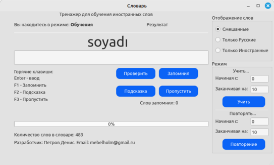

# MoreProgramm

Добро пожаловать в мой репозиторий! Меня зовут Петров Денис. В данный момент я нахожусь в поиске работы, основной язык программирования который использую С++, открыт и к другим языкам. 
Получил диплом МФТИ о профессиональной переподготовке по специальности 'Разработчик C++'.

Если вам интересна возможность сотрудничества или у вас есть предложения по работе, пожалуйста, свяжитесь со мной:

- **Email:** [mebelholm@yandex.ru](mailto:mebelholm@yandex.ru)
- **Telegram:** [https://t.me/Janjan0](https://t.me/Janjan0)

В репозитории находятся реализации различных алгоритмов и программ.

## Корневой каталог

В корне репозитория находятся следующие файлы:

- **[`CMakeLists.txt`](CMakeLists.txt)** - файл сборки некоторых программ
- **[`catch.hpp`](catch.hpp)** - файл для тестирования
- **[`codestyle_checker.sh`](codestyle_checker.sh)** - скрипт для проверки синтаксиса кода
- **[`run-clang-format.py`](run-clang-format.py)** - скрипт для коррекции синтаксиса кода

## Программы и реализации

В корневом каталоге расположены следующие проекты:

- **[`tgbot`](tgbot)** - реализация игры на tgbot с использованием SQLite3 и Catch тестов
- **[`calculator`](calculator)** - реализация многофункционального калькулятора с использованием "Польской нотации" и токенизации элементов
- **[`dictionary`](dictionary)** - тренажёр для тренировки запомнинания иностранных слов. Поддерживает все возможные языки. Сделан с помощью framework Qt. 
- 
- **[`readerBMP`](readerBMP)** - Небольшой просмотровщик ч\б BMP файлов
- **[`any`](any)** - реализация `std::any`
- **[`unique_ptr`](unique_ptr)** - реализация `std::unique_ptr`
- **[`shared_ptr`](shared_ptr)** - реализация `std::shared_ptr` без `WeakPtr`
- **[`string`](string)** - реализация `std::string`
- **[`string_view`](string_view)** - реализация `std::string_view`
- **[`gcd`](gcd)** - подробное тестирование нахождения наибольшего общего делителя
- **[`array`](array)** - реализация `std::array`
- **[`docker`](docker)** - небольшой Dockerfile для сборки Jupyter Notebook

## Папка `arhivProg`

В папке `arhivProg` хранятся однофайловые проекты:

- **[`AVL.cpp`](arhivProg/AVL.cpp)** - реализация AVL-дерева
- **[`backpack.cpp`](arhivProg/backpack.cpp)** - задача про рюкзак
- **[`bank.cpp`](arhivProg/bank.cpp)** - реализация небольшого банка с помощью `std::unordered_map`
- **[`baseData.cpp`](arhivProg/baseData.cpp)** - база данных на основе `std::map`
- **[`binSearch.cpp`](arhivProg/binSearch.cpp)** - бинарный поиск
- **[`BST.cpp`](arhivProg/BST.cpp)** - бинарное дерево поиска
- **[`compare.cpp`](arhivProg/compare.cpp)** - пример использования компаратора
- **[`complex.cpp`](arhivProg/complex.cpp)** - работа с комплексными числами и класс, представляющий квадратное уравнение
- **[`countSort.cpp`](arhivProg/countSort.cpp)** - сортировка подсчетом
- **[`decart.cpp`](arhivProg/decart.cpp)** - декартово дерево
- **[`dictionary.cpp`](arhivProg/dictionary.cpp)** - реализация словаря с помощью `std::unordered_map`
- **[`dinamikArr.cpp`](arhivProg/dinamikArr.cpp)** - реализация класса `DynamicArray`
- **[`fibonachi.cpp`](arhivProg/fibonachi.cpp)** - числа Фибоначчи
- **[`findMasElement.cpp`](arhivProg/findMasElement.cpp)** - поиск в отсортированном массиве одинакового количества элементов
- **[`findNotSort.cpp`](arhivProg/findNotSort.cpp)** - поиск в неотсортированном массиве
- **[`grafEdges.cpp`](arhivProg/grafEdges.cpp)** - поиск рёбер в неориентированной матрице
- **[`graphDeixter.cpp`](arhivProg/graphDeixter.cpp)** - реализация алгоритма Дейкстры
- **[`graphDistanse.cpp`](arhivProg/graphDistanse.cpp)** - алгоритм поиска в ширину (BFS)
- **[`graphLink.cpp`](arhivProg/graphLink.cpp)** - алгоритм поиска в ширину (BFS) для неориентированного графа
- **[`graphList.cpp`](arhivProg/graphList.cpp)** - список смежности (для работы с графом)
- **[`hashTable.cpp`](arhivProg/hashTable.cpp)** - хеш-таблица
- **[`heap.cpp`](arhivProg/heap.cpp)** - реализация структуры данных "max-heap"
- **[`heapSort.cpp`](arhivProg/heapSort.cpp)** - реализация структуры данных "max-heap" с сортировкой
- **[`kassa.cpp`](arhivProg/kassa.cpp)** - реализация размена денег на основе номиналов купюр
- **[`kleptoman.cpp`](arhivProg/kleptoman.cpp)** - задача по выбору максимального количества предметов с ограничением по общему весу
- **[`ladder.cpp`](arhivProg/ladder.cpp)** - решение задачи максимальной суммы подотрезка массива
- **[`merge.cpp`](arhivProg/merge.cpp)** - слияние двух отсортированных массивов в один отсортированный массив
- **[`mergeSort.cpp`](arhivProg/mergeSort.cpp)** - реализация алгоритма сортировки слиянием
- **[`polsequence.cpp`](arhivProg/polsequence.cpp)** - польская последовательность
- **[`queue.cpp`](arhivProg/queue.cpp)** - реализация очереди
- **[`quickSortHoar.cpp`](arhivProg/quickSortHoar.cpp)** - реализация быстрой сортировки (по Хоару)
- **[`quickSortLomuto.cpp`](arhivProg/quickSortLomuto.cpp)** - реализация быстрой сортировки (по Ломуто)
- **[`skobka.cpp`](arhivProg/skobka.cpp)** - скобочная последовательность
- **[`sortBuble.cpp`](arhivProg/sortBuble.cpp)** - сортировка пузырьком
- **[`sortInsertion.cpp`](arhivProg/sortInsertion.cpp)** - сортировка вставками
- **[`sortSelection.cpp`](arhivProg/sortSelection.cpp)** - сортировка выбором
- **[`stack.cpp`](arhivProg/stack.cpp)** - реализация стека на основе связного списка
- **[`useSet.cpp`](arhivProg/useSet.cpp)** - пример использования `std::set`

## License

All code in this repository is licensed under the [MIT License](LICENSE). See the `LICENSE` file for details.
